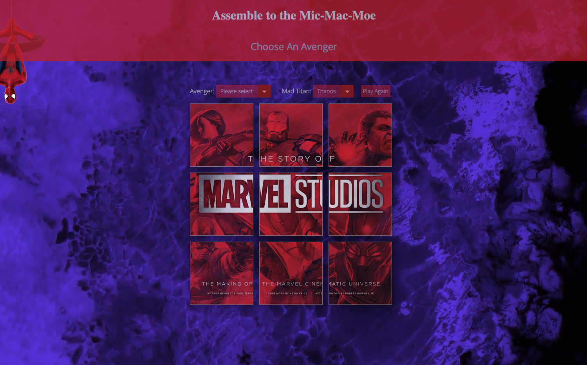

# Assemble to the Mic-Mac-Moe!!!❤️❤️❤️

## Author: 
Wen Gong

## Link:
https://wen1201.github.io/tic-tac-toe/

## Description of the project:  

The original task was to make a Tic-Tac-Toe. To bring the game to life, I combined it with my favorate Marvel Universe. This is how Mic-Mac-Moe borned!
In this game, I set up 2 players, one is an Avenger and the other is the Thanos. At the end of the game, you will see short video from The Avengers movie. As we are in the Marvel Universe, we always have an option to play again.
I tried my best to make this web page as cool as possible and am still trying to make it better as I'm a big Marvel fun. You will see your fridenly neighbourhood Peter Paker in the page. 

## Main features and any instructions:
The rules to play this game is just the same as Tic- Tax -Toe. It's just you can choose your preferred character at the drop down box. At the end of the game, you will see a short video and you can always choose to play it again.

## List of any known bugs:
* Can't play it on some browsers, they need to play on Firefox.

* The Avenger field wouldn't automatically refreshed to 'Please Select' after click the 'Play Again' tab/ refresh the web page.
* After clicked on one of the nine boxes, the image wouldn't be locked. If you click on it again, it will change to another image.

## Tech used: 
* Javascript 
* HTML 
* jQuery
* CSS

  
        

## A wishlist of features:
* Sound effect and background music need to be added.
* Add a couple bad guys in the Thanos's drop down box.
* Add computer player(AI)
* I hope this page can bring people to the Marvel Universe.
